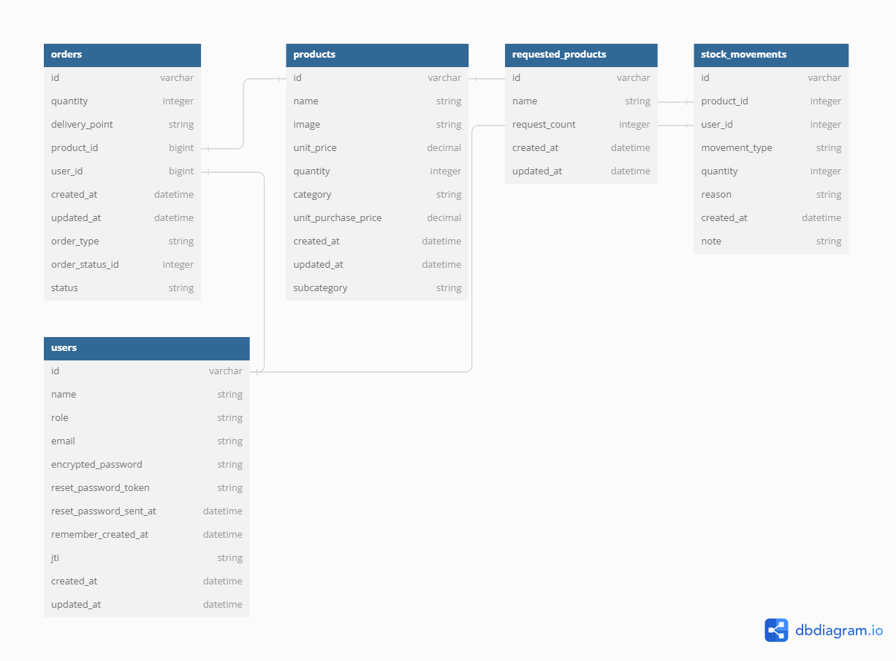

<a id="readme-top"></a>

<div align="center">
  
  <br/>
</div>

# 📗 Table of Contents

- [📗 Table of Contents](#table-of-contents)
- [📖SION BACKEND](#sion-backend)
  - [Erd diagram](#erddiagram)
  - [🛠 Built with](#built-with)
    - [Tech stack ](#tech-stack)
    - [Key features ](#key-features)
  - [🗎 API documentation ](#api-docs)
  - [🗎 Kanban Board](#kanban-board) 
  - [🚀 Live demo ](#live-demo)
  - [💻 Getting started ](#getting-started)
    - [Pre requisites](#pre-requisites)
    - [Setup ](#setup)
    - [Install ](#-install)
    - [Usage ](#usage)
    - [Run tests ](#run-tests)
    - [Deployment ](#-deployment)
  - [👥 Authors ](#-authors-)
  - [🔭 Future features ](#-future-features)
  - [🤝 Contributing ](#-contributing)
  - [⭐️ Show your support ](#️-show-your-support)
  - [🙏 Acknowledgments ](#-acknowledgments)
  - [❓ FAQ ](#-faq)
  - [📝 License ](#-license)


# 📖 **Sion Backend** <a id="sion-backend">

**Sion** is a proven digital solution that makes online shopping easy, convenient, and enjoyable for customers. The application also helps other businesses maximize their customer base through e-commerce. With Sion, we help you achieve success while also supporting you in efficient business management.

## **Erd diagram** <a id="erddiagram">


## 🛠 **Built with** <a id="built-with">

### **Tech stack** <a id="tech-stack"></a>

<details>
  <summary>Client</summary>
  <ul>
    <li><a href="https://reactjs.org/">React.js</a></li>
    <li><a href="https://tailwindcss.com/">Tailwind CSS</a></li>
    <li><a href="https://sass-lang.com/">SCSS</a></li>
  </ul>
</details>

<details>
  <summary>Server</summary>
  <ul>
    <li><a href="https://api.rubyonrails.org/">Ruby on Rails</a></li>
  </ul>
</details>

<details>
  <summary>Database</summary>
  <ul>
    <li><a href="https://www.postgresql.org/">PostgreSQL</a></li>
  </ul>
</details>

### **Key features** <a id="key-features"></a>

> Key features of the application are

- **Fetch all orders**
- **Fetch all products**
- **Authenticate users**
- **Add product**
- **Delete product**
- **Place orders**
- **Delete orders**
<p align="right">(<a href="#readme-top">back to top</a>)</p>

## 🗎 **API documentation** <a id="api-docs"></a>
> <a href="./Sion-api.yaml">local API Doc link</a>

> <a href="https://app.swaggerhub.com/apis-docs/OLIVIERKANGO/PSS-Digital/1.0.0">Remote API Doc link</a>

##  Kanban Board <a id="kanban-board"></a>
- At the beginning we were a team of five (after our studies at Microverse) we used Kanban board to manage our project tasks

- Check here Kanban Board [Kanban Board](https://github.com/users/DaveZag/projects/2/views/1)

- Here  is the link to [kanban board initial state](https://user-images.githubusercontent.com/108806646/223073503-281902af-2be4-44a1-840c-394ca01a7447.png)


<!-- React Frontend -->
###   <a href="https://github.com/Olivier-Kango/sion-frontend">Sion-Frontend</a>


## 🚀 **Live demo** <a id="live-demo"></a>

- [Live Demo](https://sion-digital.vercel.app/)

<p align="right">(<a href="#readme-top">back to top</a>)</p>


## 💻 **Getting started** <a id="getting-started"></a>

> This project can be used by anyone for any good purpose.

To get a local copy up and running, follow these steps.

### **Pre requisites**

In order to run this project you need:

> - Ruby and Rails on you operating system eg. for  [Windows](https://gorails.com/setup/windows/10) or [Linux](https://gorails.com/setup/ubuntu/20.04)
> - React.js
> - [Install nodejs](https://nodejs.org/ca/blog/release/v16.19.0/)
> - [PostgreSQL](https://www.postgresql.org/) database installed
> - [Install Git](https://git-scm.com/)
> - Install a code editor of your choice
> - Knwoledge of javascript and react
> - Github account is required

### **Setup** <a id="setup"></a>

Clone this repository to your desired folder:

```sh
  git clone https://github.com/Olivier-Kango/sion-backend.git
```

### **Install**

Install this project with:

```sh
  cd sion-backend # Change directory into project folder
  bundle install # Installs project dependencies
```
### Important steps after installing project to local machine
1) Please run rails db:create and rails db:migrate. 
2) Check Ruby version and database.yml file. ( Insert your password if there is required)

### **Usage** <a id="usage"></a>

To run the project, execute the following command:

```sh
  rails s # for running the project in development mode
```
### **Run tests** <a id="run-tests"></a>

To run tests, run the following command:

```sh
  rubocop -A # for checking and correcting linter errors
  rake rswag # for checking the API documentation
```
Note: If for some reason you are not able to run the tests, please delete the folowing files:
```sh
  config/credentials.yml.enc
  config/master.key

  and run the following commands:
  EDITOR="code --wait" bin/rails credentials:edit

  and then run the tests again
```

### **Deployment**

You can deploy this project using:

<!--
Example:

```sh

```
 -->

<p align="right">(<a href="#readme-top">back to top</a>)</p>


## 👥 **Authors** <a id="authors"></a>

👤 **Dave Zagabe From DRC - Bukavu** 

[](https://github.com/daveZag/)
[](https://www.linkedin.com/in/davezagabe/)
[](https://twitter.com/davezagabe2/)

👤 **Kasaija Kenneth from Uganda** 

[](https://github.com/Kasaija-Kenneth/)
[](https://www.linkedin.com/in/kasaija-kenneth/)
[](https://twitter.com/kenn_ug/)

👤 **Kaweesi Matia from Uganda** 

[](https://github.com/Kaweesi-Matia/)
[](https://www.linkedin.com/in/kaweesi-matia/)
[](https://twitter.com/kaweesimatia/)

👤 **Olivier Kango from DRC - Goma** 

[](https://github.com/Olivier-Kango/)
[](https://www.linkedin.com/in/olivier-kango-b990601b8/)
[](https://twitter.com/olivierkango1/)


👤 **Elijah Odjegba from Nigeria** 

[](https://github.com/Elijahdre/)
[](https://www.linkedin.com/in/elijah-odjegba/)
[](https://twitter.com/kingglijah/)
<p align="right">(<a href="#readme-top">back to top</a>)</p>


## 🔭 **Future Features** <a id="future-features"></a>
- Implement Mobile Version
- Add the ability to upload an Image

<p align="right">(<a href="#readme-top">back to top</a>)</p>


## 🤝 **Contributing** <a id="contributing"></a>

Contributions, issues, and feature requests are welcome!

Feel free to check the [issues page](https://github.com/Olivier-Kango/sion-backend/issues/new).

<p align="right">(<a href="#readme-top">back to top</a>)</p>


## ⭐️ **Show your support** <a id="support"></a>

If you like this project buy us a [drink](.../.../)

<p align="right">(<a href="#readme-top">back to top</a>)</p>


## 🙏 **Acknowledgments** <a id="acknowledgements"></a>

I would like to acknowledge:

- [Microverse](https://www.microverse.org/) for the opportunity to work on this project
- [The creative common](https://www.behance.net/gallery/19759151/Snapscan-iOs-design-and-branding?tracking_source=) for the design
- Design from [Murat Korkmaz on Behance](https://www.behance.net/gallery/26425031/Vespa-Responsive-Redesign)


<p align="right">(<a href="#readme-top">back to top</a>)</p>

## ❓ **FAQ** <a id="faq"></a>

- **Is Rails still relevant?**

  - [Yes, Rails is still popular among developer](https://blog.railwaymen.org/is-ruby-on-rails-dead)

- **Is it easy to learn Ruby on Rails**

  - [It is very easy to learn compared to most of the programming languages](https://careerkarma.com/blog/why-learn-ruby-on-rails/)

<p align="right">(<a href="#readme-top">back to top</a>)</p>

<!-- LICENSE -->

## 📝 **License** <a id="license"></a>

This project is [MIT](./MIT.md) licensed.

<p align="right">(<a href="#readme-top">back to top</a>)</p>
